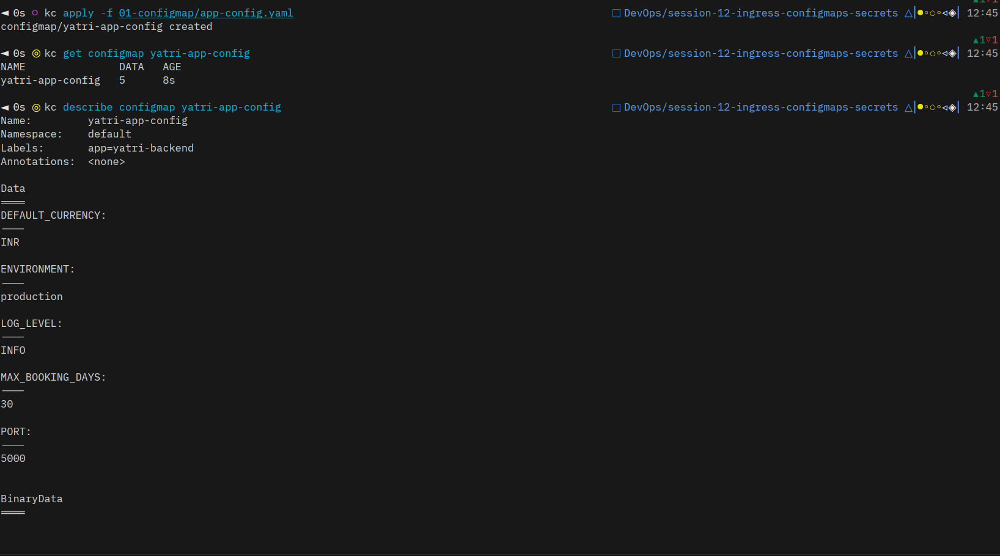
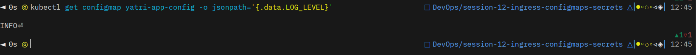
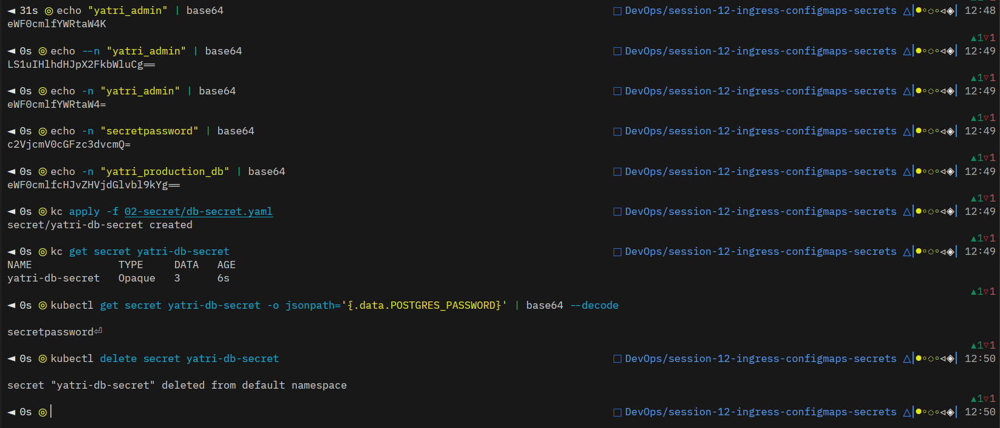

# Difference between Ingress and Ingress Controller

- **Ingress:** A Kubernetes API resource / object (YAML manifest) that defines rules for routing external HTTP/HTTPS traffic to internal services within the cluster (such as path-based routing, host-based routing, and TLS/SSL termination). By itself, an Ingress resource is merely a configuration blueprint and performs no active routing.
- **Ingress Controller:** The actual running daemon/pod (reverse proxy software such as NGINX, Traefik, HAProxy, Envoy) deployed in the cluster that continuously monitors the Kubernetes API for `Ingress` resources, parses the declared routing rules, and actively processes and routes incoming network traffic to the appropriate backend pods.

# ConfigMap

# Secret

