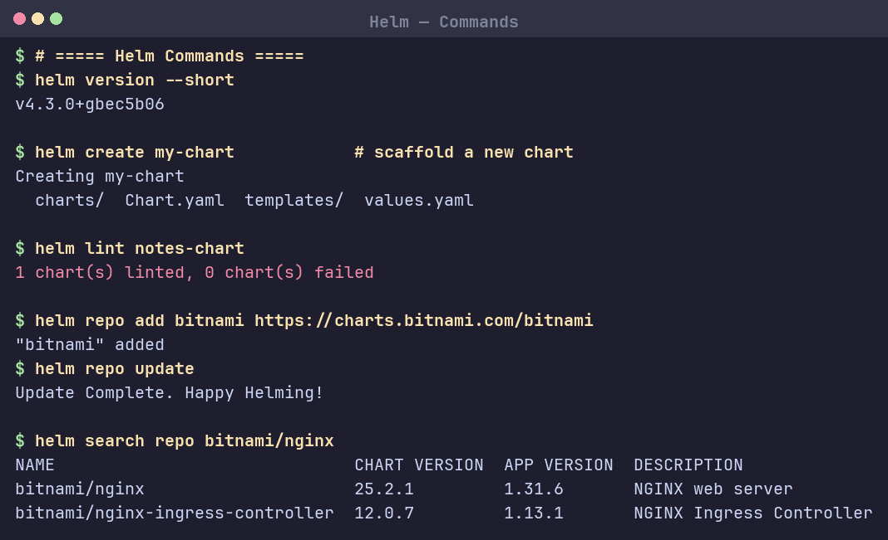
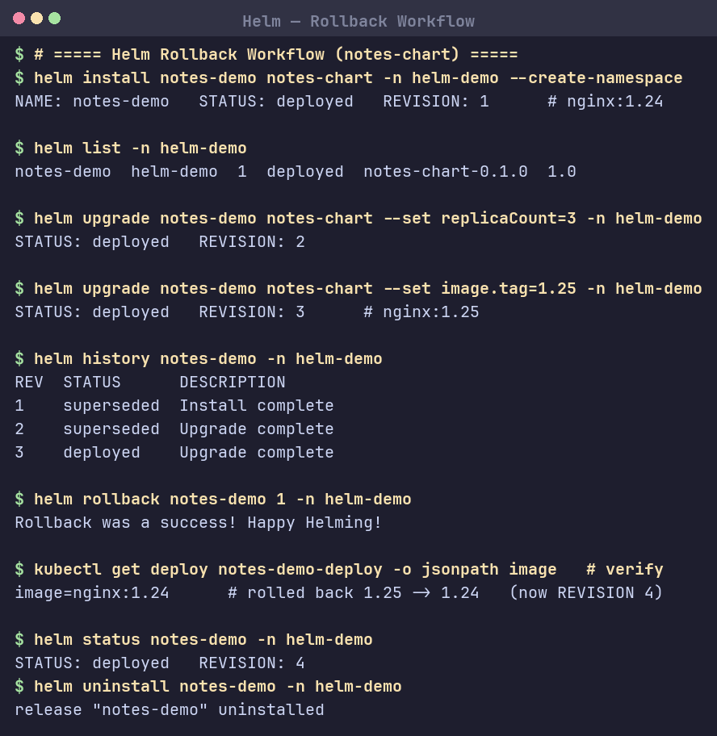

# Session 15: Helm

## Task 1: Helm Commands
Hands-on with the core Helm commands (Helm v4.3.0).

| Command | Purpose |
|---|---|
| `helm create` | Scaffold a new chart (`charts/`, `Chart.yaml`, `templates/`, `values.yaml`) |
| `helm install` | Deploy a chart as a release → revision 1 |
| `helm list` | List installed releases |
| `helm status` | Show a release's status + revision |
| `helm get` | Fetch a release's manifest/values |
| `helm upgrade` | Apply changes → new revision |
| `helm history` | Revision history of a release |
| `helm rollback` | Revert a release to an earlier revision |
| `helm uninstall` | Remove a release |
| `helm repo` | Manage chart repositories (`add`/`update`) |
| `helm search` | Search repos for charts |

## Task 2: Helm Rollback
Full workflow with [`mini-project/notes-chart`](mini-project/notes-chart): **Install → Upgrade → Verify → Upgrade → Verify → Rollback → Verify**.

| Revision | Action | Result |
|---|---|---|
| 1 | `install` | `nginx:1.24`, replicas 1 |
| 2 | `upgrade --set replicaCount=3` | scaled up |
| 3 | `upgrade --set image.tag=1.25` | `nginx:1.25` |
| 4 | `rollback 1` | back to `nginx:1.24` ✓ verified |

Rollback creates a **new** revision (4) that restores an old release state rather than deleting history.

## Task 3: Mini Project
Helm chart [`mini-project/notes-chart`](mini-project/notes-chart) — `Chart.yaml`, `values.yaml`, and templates (`deployment.yaml`, `service.yaml`, `configmap.yaml`) parameterised via values; installed, upgraded, rolled back, and uninstalled as shown above (`helm lint` passes).
