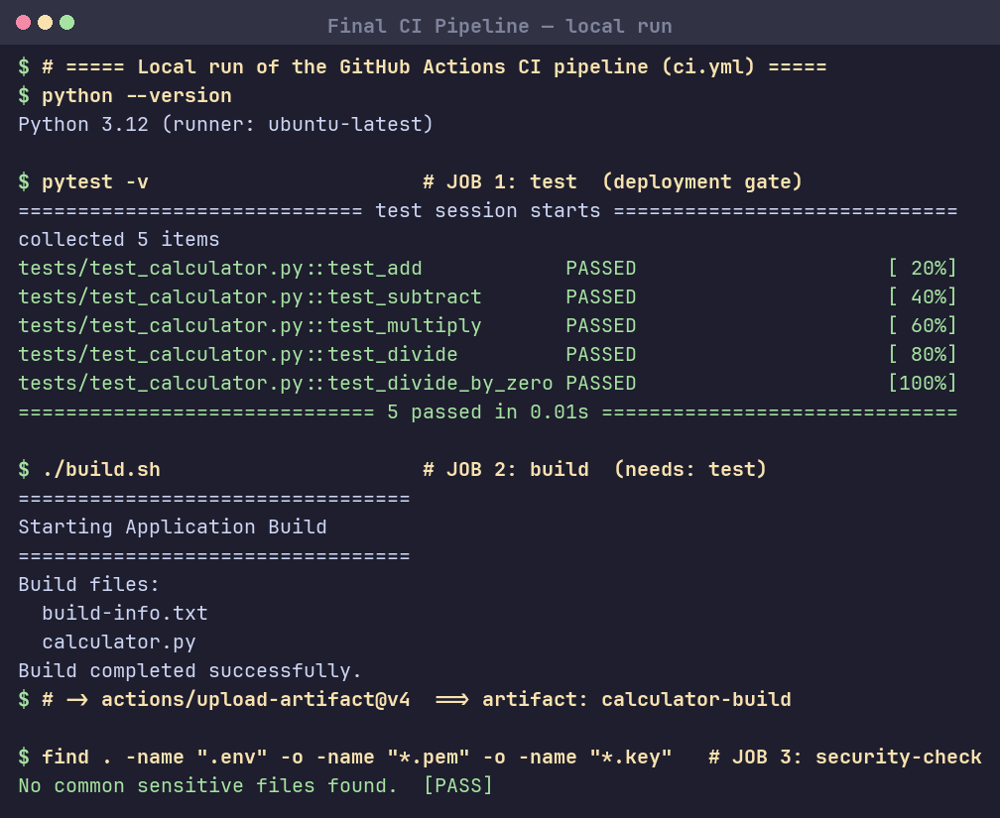
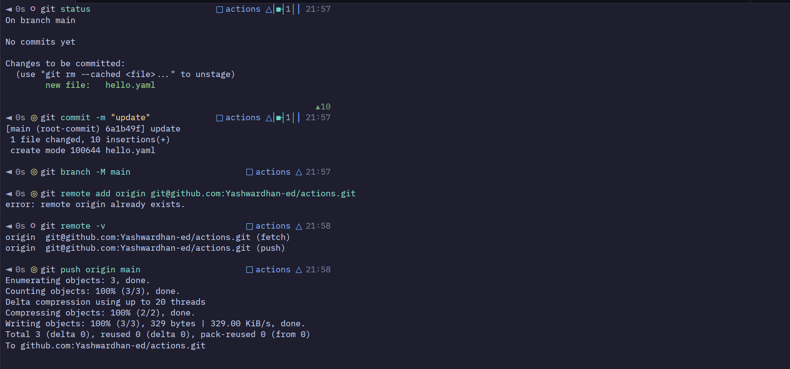
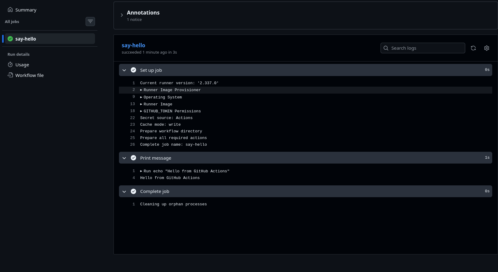

# Session 16: CI/CD & GitHub Actions

## Task: CI/CD Demo Project
Complete GitHub Actions CI/CD pipeline — reference project: [`10-final-cicd-pipeline`](session-16-github-actions/10-final-cicd-pipeline/).

| Concept | Where it is implemented |
|---|---|
| **CI vs CD** | CI validates every push/PR (test); CD packages the deployable build artifact |
| **CI/CD Pipeline** | Multi-stage flow: `test` → `build` + `security-check` |
| **Workflow** | `.github/workflows/ci.yml` |
| **Jobs** | `test`, `build`, `security-check` |
| **Steps** | `uses:` (actions) and `run:` (shell) units inside each job |
| **Runners** | `runs-on: ubuntu-latest` |
| **Triggers** | `push`, `pull_request`, `workflow_dispatch` |
| **Secrets** | Injected via `${{ secrets.* }}` env |
| **Artifacts** | `actions/upload-artifact@v4` → `calculator-build` |
| **Build** | `build.sh` produces `build/` bundle + `build-info.txt` |
| **Test** | `pytest` acts as the deployment gate (`build`/`security` use `needs: test`) |

## Pipeline (`ci.yml`)
```
test (gate) ──► build ──► upload-artifact: calculator-build
            └─► security-check (scan for .env / *.pem / *.key)
```

## Screenshots

**Local run of the pipeline (test → build → security-check):**


**Pushing the workflow repo to GitHub:**


**GitHub Actions pipeline execution:**

