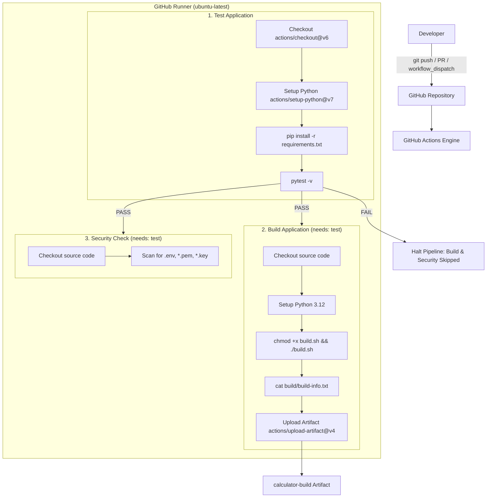

# Session 16: CI/CD & GitHub Actions — Testing & Execution Guide

This guide contains all the commands to run and test each GitHub Actions workflow and pipeline component in **Session 16**, built around the demo project in [10-final-cicd-pipeline](file:///home/yashwardhan/Documents/Term%209/DevOps/session-16-github-actions/session-16-github-actions/10-final-cicd-pipeline/).

---

## Table of Contents
1. [Architecture & Pipeline Overview](#1-architecture--pipeline-overview)
2. [CI vs CD (Continuous Integration vs Continuous Delivery)](#2-ci-vs-cd)
3. [CI/CD Pipeline Stages](#3-cicd-pipeline-stages)
4. [GitHub Actions Core Concepts](#4-github-actions)
5. [Workflow Definition & Triggers](#5-workflow-definition--triggers)
6. [Jobs (Parallel & Dependent Jobs)](#6-jobs)
7. [Steps & Actions (`uses` vs `run`)](#7-steps--actions)
8. [Runners (`runs-on`)](#8-runners)
9. [Secrets Management](#9-secrets-management)
10. [Artifacts (Build Packaging & Downloading)](#10-artifacts)
11. [Build Process](#11-build-process)
12. [Testing (Pass & Fail Gatekeeping)](#12-testing-pass--fail-gatekeeping)
13. [Security Check (Sensitive File Gatekeeper)](#13-security-check)
14. [Complete End-to-End Execution Commands](#14-complete-end-to-end-execution-commands)
15. [Quick Reference Command Cheat Sheet](#15-quick-reference-command-cheat-sheet)

---

## 1. Architecture & Pipeline Overview



---

## 2. CI vs CD

### Concepts
* **CI (Continuous Integration)**: Developers integrate code into a shared repository frequently. Every push triggers automated builds, syntax checks, and automated tests to catch errors early.
* **CD (Continuous Delivery)**: Extends CI by ensuring every tested change is automatically packaged and deployable to staging/production on demand.
* **CD (Continuous Deployment)**: Automates the entire release path into production without manual human approval.

### Simulation Commands to Test
In `01-ci-vs-cd`:

```bash
# 1. Navigate to 01-ci-vs-cd
cd "session-16-github-actions/01-ci-vs-cd 10-33-34-211"

# 2. Test CI simulation (Build + Test validation)
chmod +x ci_simulation.sh
./ci_simulation.sh

# 3. Test CD simulation (Build + Test + Package + Deployment)
chmod +x cd_simulation.sh
./cd_simulation.sh
```

---

## 3. CI/CD Pipeline Stages

### Concepts
A pipeline connects multiple stages in a strict sequence:
1. **Checkout**: Retrieve source code from VCS.
2. **Setup**: Prepare runtime dependencies (Python 3.12, pip).
3. **Test**: Execute automated unit tests.
4. **Build**: Bundle code and metadata.
5. **Security Check**: Scan for secrets and sensitive files.
6. **Package / Artifact**: Persist build outputs.

### Simulation Commands to Test
In `02-pipeline-concepts`:

```bash
cd "session-16-github-actions/02-pipeline-concepts 10-33-34-222"
chmod +x pipeline_stages.sh
./pipeline_stages.sh
```

---

## 4. GitHub Actions

### Concepts
GitHub Actions runs workflows defined in YAML files inside the `.github/workflows/` directory.

### Workflow Reference: `hello-actions.yml`
```yaml
name: Hello GitHub Actions
on:
  workflow_dispatch:
jobs:
  hello:
    runs-on: ubuntu-latest
    steps:
      - name: Print message
        run: echo "Hello from GitHub Actions!"
      - name: Show date
        run: date
      - name: Show operating system
        run: uname -a
```

### Commands to Run & Test
```bash
# Test locally using act (if installed)
act workflow_dispatch -W session-16-github-actions/03-github-actions/.github/workflows/hello-actions.yml

# Trigger manually via GitHub CLI
gh workflow run hello-actions.yml

# View recent runs
gh run list --workflow=hello-actions.yml

# Watch live logs
gh run watch

# Inspect execution logs
gh run view --log
```

---

## 5. Workflow Definition & Triggers

### Triggers Supported
1. `push`: Triggers automatically on code pushed to specified branches.
2. `pull_request`: Triggers when PRs are opened, synchronized, or reopened against target branches.
3. `workflow_dispatch`: Enables manual triggering with optional input parameters.
4. `schedule`: Cron-based scheduled triggers (e.g. `cron: '0 0 * * *'`).

### Workflow Trigger Definition (`ci.yml`)
```yaml
name: Final CI Pipeline
on:
  push:
    branches:
      - main
  pull_request:
    branches:
      - main
  workflow_dispatch:
```

### Commands to Test Each Trigger
```bash
# 1. Test workflow_dispatch (manual run)
gh workflow run ci.yml --ref main

# 2. Test push trigger
git checkout main
git commit --allow-empty -m "test: trigger CI via git push"
git push origin main

# 3. Test pull_request trigger
git checkout -b feature/test-ci-trigger
git commit --allow-empty -m "test: trigger CI via pull request"
git push -u origin feature/test-ci-trigger
gh pr create --title "Test CI on PR" --body "Testing GitHub Actions PR trigger" --base main
```

---

## 6. Jobs

### Concepts
* Jobs contain one or more steps.
* By default, jobs run in **parallel**.
* To create sequential dependencies, use `needs: <job_name>`.

### Dependency Graph in `ci.yml`
```yaml
jobs:
  test:
    name: Test Application
    runs-on: ubuntu-latest
    ...
  build:
    name: Build Application
    needs: test
    runs-on: ubuntu-latest
    ...
  security-check:
    name: Security Check
    needs: test
    runs-on: ubuntu-latest
    ...
```

### Commands to Test Jobs
```bash
# Run specific job locally with act
act -j test
act -j build
act -j security-check

# Inspect job statuses via GitHub CLI
gh run view <RUN_ID>
```

---

## 7. Steps & Actions (`uses` vs `run`)

### Concepts
* `uses`: Invokes reusable community/official actions (e.g., `actions/checkout@v6`, `actions/setup-python@v7`, `actions/upload-artifact@v4`).
* `run`: Executes shell commands directly on the runner VM.

### Commands to Test Steps Locally
Run each step's shell commands locally to verify they succeed before pushing:

```bash
# Step 1: Check Python version
python3 --version

# Step 2: Install dependencies
python3 -m pip install --upgrade pip
pip install -r requirements.txt

# Step 3: Run pytest
pytest -v

# Step 4: Run build script
chmod +x build.sh
./build.sh

# Step 5: Check build output
cat build/build-info.txt
```

---

## 8. Runners (`runs-on`)

### Concepts
A runner is the virtual machine executing workflow jobs.
* `runs-on: ubuntu-latest`: Ephemeral Ubuntu Linux VM provided by GitHub.
* Self-hosted runners: User-provisioned machines running the actions-runner daemon.

### Commands to Inspect Runner Environment
Run within a workflow step to audit the runner:

```bash
hostname
uname -a
whoami
pwd
ls -la
python3 --version
free -m
df -h
```

---

## 9. Secrets Management

### Concepts
Secrets store sensitive credentials (API tokens, SSH keys, passwords) encrypted in GitHub repository settings.
Workflows access secrets via `${{ secrets.SECRET_NAME }}`. Values are automatically redacted in runner logs.

### Commands to Set & Test Secrets
```bash
# 1. Set secret using GitHub CLI
gh secret set DEMO_SECRET --body "hello-github-actions"

# 2. Verify secret is listed (values remain hidden)
gh secret list

# 3. Test secret in workflow safely (never echo raw secret)
# Workflow snippet:
# - name: Verify Secret
#   env:
#     DEMO_SECRET: ${{ secrets.DEMO_SECRET }}
#   run: |
#     if [ -n "$DEMO_SECRET" ]; then
#       echo "Secret is configured."
#     else
#       echo "Secret missing."
#       exit 1
#     fi

# 4. Test workflow with secrets locally using act
act workflow_dispatch -s DEMO_SECRET="hello-github-actions"
```

---

## 10. Artifacts

### Concepts
Artifacts preserve files generated during a workflow run (e.g., compiled binaries, test reports, tarballs) after the runner VM is destroyed.

### Workflow Configuration (`actions/upload-artifact@v4`)
```yaml
- name: Upload build artifact
  uses: actions/upload-artifact@v4
  with:
    name: calculator-build
    path: build/
```

### Commands to Test & Download Artifacts
```bash
# 1. Generate local build artifact
chmod +x build.sh
./build.sh
ls -la build/

# 2. Trigger pipeline and find run ID
gh workflow run ci.yml
RUN_ID=$(gh run list --workflow=ci.yml --limit 1 --json databaseId --jq '.[0].databaseId')

# 3. Download the artifact from GitHub
gh run download $RUN_ID -n calculator-build -D ./downloaded-artifact

# 4. Inspect the artifact files
ls -la ./downloaded-artifact/
cat ./downloaded-artifact/build-info.txt
```

---

## 11. Build Process

### Build Script (`build.sh`)
```bash
#!/bin/bash
set -e
echo "Starting Application Build..."
rm -rf build
mkdir -p build
cp app/calculator.py build/
cat > build/build-info.txt <<EOF
Application: Session 16 Calculator
Build Status: SUCCESS
Build Date: $(date)
EOF
echo "Build completed successfully."
```

### Commands to Test Build
```bash
# Make executable
chmod +x build.sh

# Execute build
./build.sh

# Verify output files exist
test -f build/calculator.py && echo "calculator.py packaged"
test -f build/build-info.txt && cat build/build-info.txt
```

---

## 12. Testing (Pass & Fail Gatekeeping)

### Test Suite (`tests/test_calculator.py`)
```python
import pytest
from app.calculator import add, subtract, multiply, divide

def test_add():
    assert add(10, 5) == 15

def test_subtract():
    assert subtract(10, 5) == 5

def test_multiply():
    assert multiply(10, 5) == 50

def test_divide():
    assert divide(10, 5) == 2

def test_divide_by_zero():
    with pytest.raises(ValueError):
        divide(10, 0)
```

### A. Run Passing Tests Locally
```bash
python3 -m pip install -r requirements.txt
pytest -v tests/test_calculator.py
```
*Expected: 5 passed in 0.0xs*

### B. Simulate CI Failure (Broken Code Test)
Intentionally break the code in `app/calculator.py`:
```python
def add(a, b):
    return a + b + 1  # Bug
```

```bash
# 1. Run local test - verify failure is detected
pytest -v tests/test_calculator.py
# FAILED tests/test_calculator.py::test_add

# 2. Commit and push broken code
git add app/calculator.py
git commit -m "test: simulate broken code to test CI gatekeeper"
git push origin main

# 3. Monitor GitHub Actions
gh run watch
# Result: Test Application fails (Exit code 1).
# Dependent jobs (Build Application, Security Check) are skipped!
```

### C. Fix the Code & Verify Recovery
```python
def add(a, b):
    return a + b  # Fixed
```

```bash
# 1. Verify fix locally
pytest -v tests/test_calculator.py

# 2. Commit and push
git add app/calculator.py
git commit -m "fix: resolve calculator add bug"
git push origin main

# 3. Check status
gh run watch
# Result: All jobs pass (Test PASS -> Build PASS -> Security PASS)
```

---

## 13. Security Check

### Security Check Step in `ci.yml`
```bash
echo "Checking repository for common sensitive files..."
if find . -type f \( \
  -name ".env" \
  -o -name "*.pem" \
  -o -name "*.key" \
\) | grep -q .; then
  echo "Potential sensitive file found."
  exit 1
else
  echo "No common sensitive files found."
fi
```

### Commands to Test Security Gatekeeper
```bash
# Test 1: Verify clean state passes locally
find . -type f \( -name ".env" -o -name "*.pem" -o -name "*.key" \)

# Test 2: Trigger intentional security failure
touch .env
git add .env
git commit -m "test: simulate accidental credential commit"
git push origin main

# Watch security failure
gh run watch
# Result: Security Check job FAILS with "Potential sensitive file found."

# Test 3: Remove sensitive file and fix
git rm .env
rm -f .env
git commit -m "fix: remove sensitive credentials"
git push origin main
gh run watch
# Result: Security Check PASS
```

---

## 14. Complete End-to-End Execution Commands

Here is the complete sequence of commands to set up, test, push, and monitor the demo project from start to finish:

```bash
# 1. Navigate to final pipeline project directory
cd "/home/yashwardhan/Documents/Term 9/DevOps/session-16-github-actions/session-16-github-actions/10-final-cicd-pipeline"

# 2. Local validation of app, tests, and build
python3 app/calculator.py << 'EOF'
10 + 5
q
EOF

python3 -m pip install -r requirements.txt
pytest -v tests/test_calculator.py
chmod +x build.sh && ./build.sh

# 3. Initialize Git repository
git init
git branch -M main

# 4. Add remote repository (replace with your GitHub repository URL)
git remote add origin https://github.com/<YOUR_USERNAME>/session16-cicd-github-actions.git

# 5. Commit and push
git add .
git commit -m "feat: complete CI/CD demo project with test, build, security-check, and artifacts"
git push -u origin main

# 6. Monitor workflow runs
gh run list
gh run watch

# 7. Download and verify build artifact
RUN_ID=$(gh run list --limit 1 --json databaseId --jq '.[0].databaseId')
gh run download $RUN_ID -n calculator-build -D ./dist
ls -la ./dist
cat ./dist/build-info.txt
```

---

## 15. Quick Reference Command Cheat Sheet

| Task | Command |
|---|---|
| **Run app** | `python3 app/calculator.py` |
| **Run tests** | `pytest -v` |
| **Execute build script** | `chmod +x build.sh && ./build.sh` |
| **Check git status** | `git status` |
| **Commit & Push** | `git add . && git commit -m "..." && git push origin main` |
| **Trigger manual workflow** | `gh workflow run ci.yml --ref main` |
| **List pipeline runs** | `gh run list` |
| **Watch active run** | `gh run watch` |
| **View logs of run** | `gh run view <RUN_ID> --log` |
| **Download artifact** | `gh run download <RUN_ID> -n calculator-build` |
| **Set GitHub Secret** | `gh secret set DEMO_SECRET --body "secret_value"` |
| **Run workflow locally (act)** | `act workflow_dispatch` |
