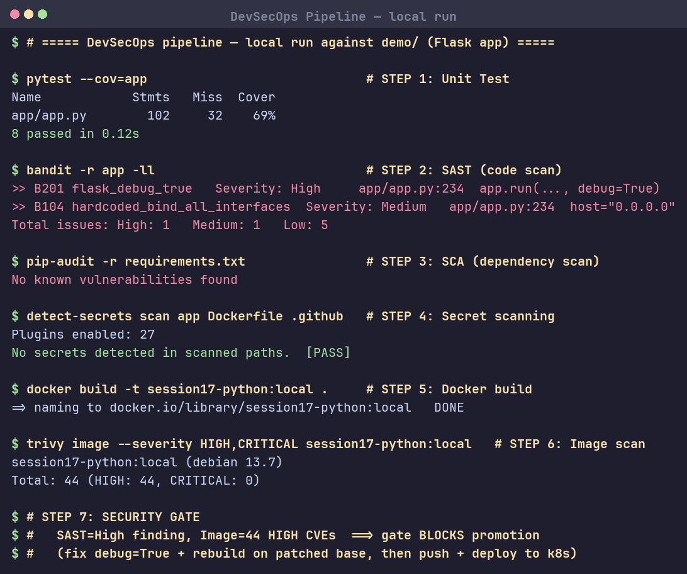

# Session 17: Complete CI/CD & DevSecOps

## Task: DevSecOps Demo Project
CI/CD + security pipeline — reference: [`demo/`](demo/), workflow [`demo/.github/workflows/devsecops.yml`](demo/.github/workflows/devsecops.yml).

### Pipeline flow (security gate before deploy)
```
Code → Build → Unit Test → SAST → SCA → Secret Scan
     → Docker Build → Image Scan → Security Gate → Push → Deploy to Kubernetes
```

### Stages & tools
| Stage | Tool | Result (local run) |
|---|---|---|
| Unit Test | pytest + coverage | 8 passed, 69% coverage |
| **SAST** (code) | Bandit | 1 High (`debug=True`), 1 Medium, 5 Low |
| **SCA** (deps) | pip-audit | No known vulnerabilities |
| **Secret scanning** | detect-secrets | No secrets detected |
| Docker Build | docker | `session17-python:local` built |
| **Container image scan** | Trivy | 44 HIGH CVEs in base image |
| **Security gate** | `needs:` dependency | blocks Push/Deploy until scans pass |

CI/CD also covers: container registry (Docker Hub push) and Kubernetes deployment (`k8s/deployment.yaml`, `k8s/service.yaml`).

## Screenshot

