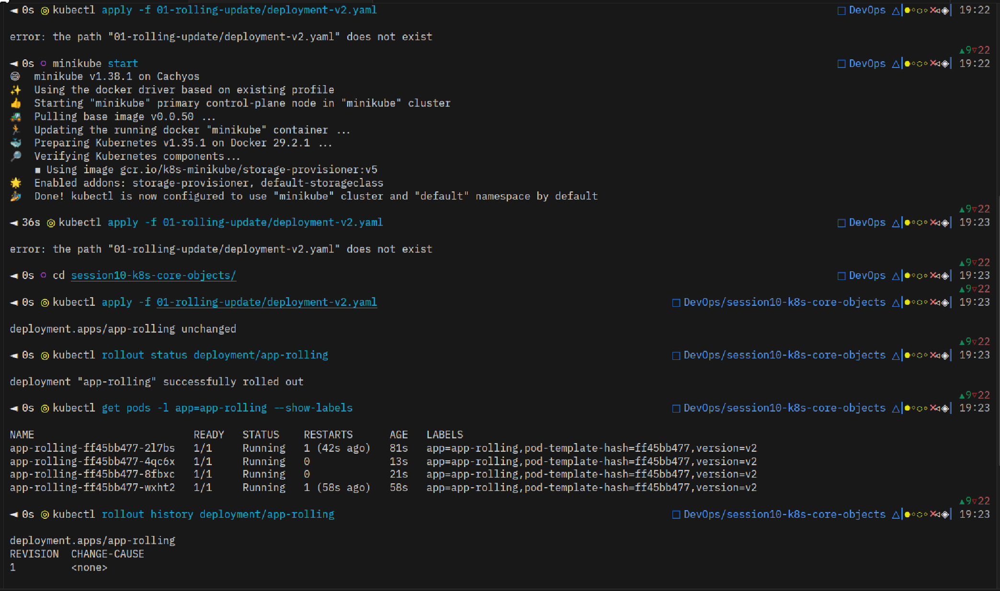
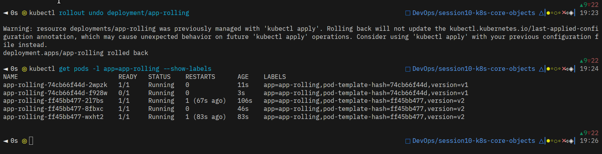
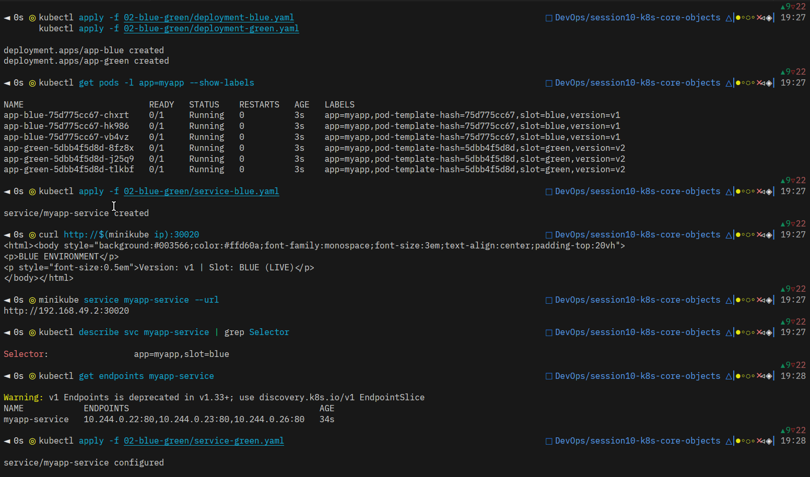
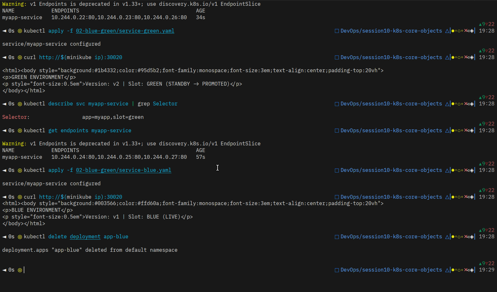
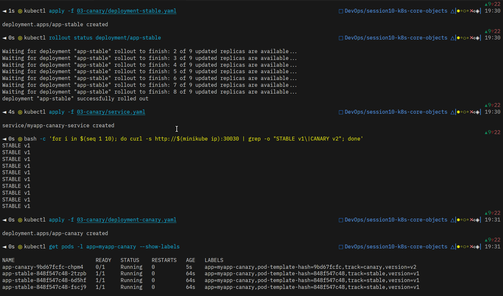
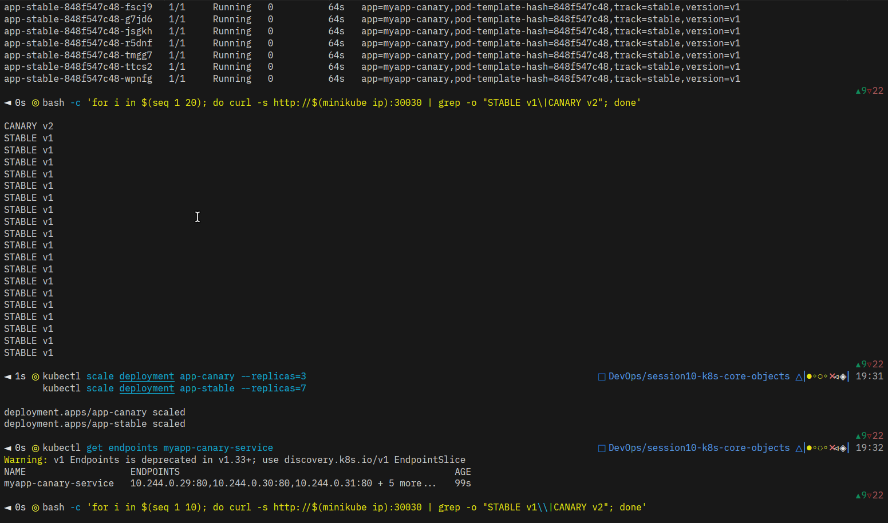
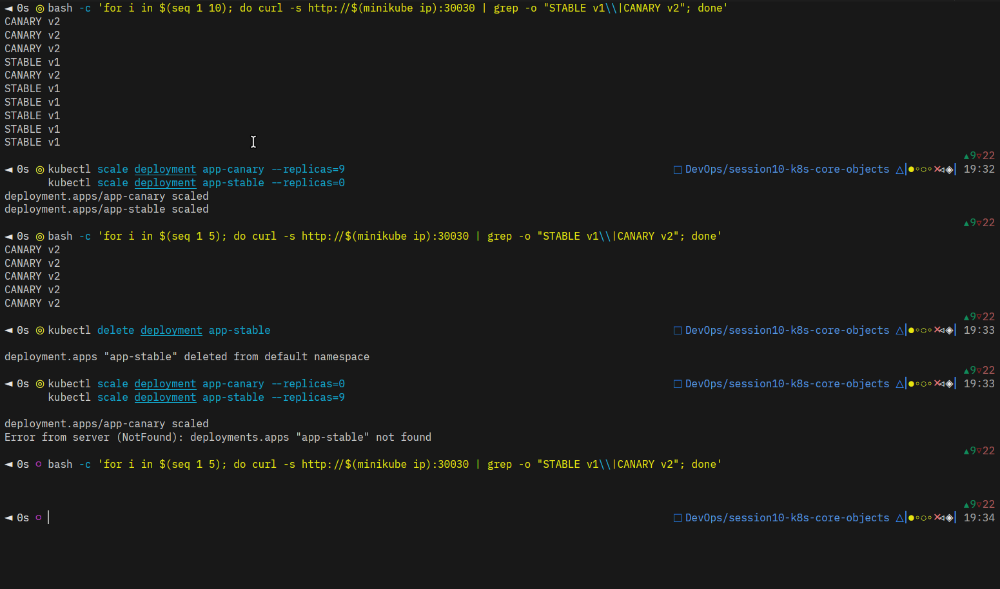

# Difference between DaemonSet, StatefulSet and Deployment

### Deployment

- Deployment manages the replicasets that are creates so that it can provide updates, rolling updates, or automatic rollbacks

### Rolling Updates

- The responsibily of a replicaset is to ensure that there is always a replica or identical pod running so that during downtime of one or more pods, there exists a replica that will be up and running ensuring 100% uptime.

### StatefulSet

- The responsibily of the stateful set is to maintain the stateful resources like persistent storage or stable, unique network identities.

# Rolling-Updates

# Blue Green Deployment

# Canary Deployment

