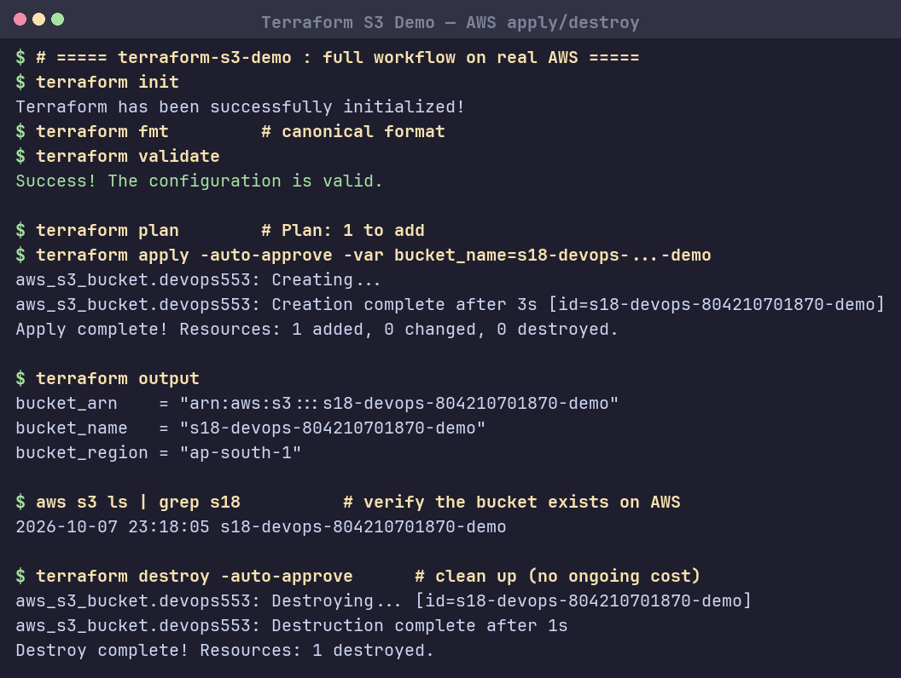

# Session 18: Terraform & Infrastructure as Code

## Task 1: Terraform S3 Demo
Project [`terraform-s3-demo/`](terraform-s3-demo/) creates an AWS S3 bucket.

```
terraform-s3-demo/
├── main.tf        # aws_s3_bucket.devops553 (force_destroy, tags)
├── variables.tf   # aws_region, bucket_name
├── outputs.tf     # bucket_name, bucket_arn, bucket_region
├── providers.tf   # provider "aws" { region = var.aws_region }
├── terraform.tf   # required_version + hashicorp/aws ~> 6.0
└── README.md
```

**Workflow** — `init` → `fmt` → `validate` → `plan` → `apply` → `show` → `output` → `destroy`.
Ran end-to-end on real AWS (account `804210701870`, region `ap-south-1`): the bucket was created (`apply`), verified with `aws s3 ls`, then removed (`destroy`) — no ongoing cost.

### Screenshot


## Task 2: AWS Services Research

**01. IAM — Governance:** Identity & Access Management. **Users** (people/apps), **Groups** (collections of users), **Roles** (temporary assumed identity for services/cross-account). **Policies** are JSON permission documents attached to users/groups/roles. Follow **least privilege** (grant only what's needed). Best practices: enable MFA, no root for daily use, prefer roles over long-lived keys, rotate credentials.

**02. EC2 — Compute:** Elastic virtual servers. **AMI** = machine image template; **instance types** = CPU/RAM sizing (t3.micro…); **key pairs** = SSH login; **Security Groups** = stateful instance firewall; **EBS** = persistent block storage; **public vs private IP** (internet-facing vs internal); lifecycle: pending→running→stopping→stopped→terminated.

**03. S3 — Storage:** Object storage. **Buckets** hold **objects** (key + data + metadata). **Storage classes** (Standard, IA, Glacier) trade cost vs access speed. **Versioning** keeps object history; **lifecycle policies** auto-transition/expire; **encryption** (SSE-S3/KMS); **bucket policies** control access. Use: backups, static sites, data lakes.

**04. VPC — Networking:** Isolated virtual network. **CIDR** defines IP range; **subnets** split it per-AZ; **route tables** direct traffic; **Internet Gateway** = public internet access; **NAT Gateway** = outbound-only for private subnets. **Security Groups** (stateful, instance) vs **Network ACLs** (stateless, subnet). **Public subnet** routes to IGW; **private subnet** does not.

**05. DynamoDB & RDS — Databases:**
- **DynamoDB** — managed **NoSQL**; **tables → items → attributes**; **partition key** (+ optional **sort key**) for access. Use: high-scale key-value / low-latency workloads.
- **RDS** — managed **relational** DB (MySQL, PostgreSQL, MariaDB, Oracle, SQL Server). **DB instances**, automated **backups**, **Multi-AZ** for HA failover, **read replicas** for read scaling, security via SG/subnet groups.
