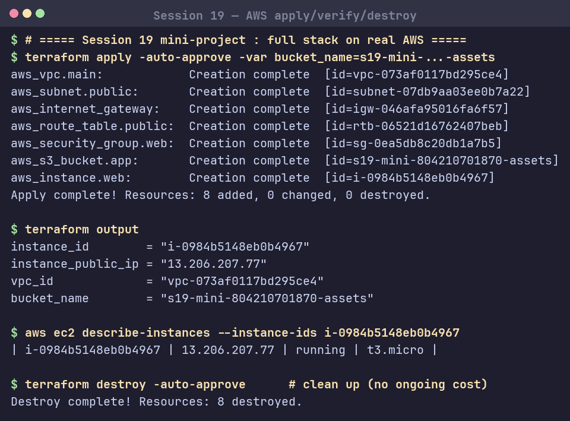

# Session 19: Cloud & Terraform in Action

## Task: End-to-End AWS Infrastructure with Terraform
Project: [`08-mini-project/`](08-mini-project/).

### Architecture
```
Terraform (hashicorp/aws ~> 6.0)
 ├── VPC            10.20.0.0/16 (DNS enabled)
 ├── Subnet         public 10.20.1.0/24 (map_public_ip)
 ├── Internet GW    + Route Table (0.0.0.0/0) + association
 ├── Security Group web — ingress 80/443, egress all
 ├── EC2            t3.micro (AL2023 AMI) in subnet + SG
 └── S3             application-assets bucket
```

### Concepts demonstrated
| Concept | In the code |
|---|---|
| Providers | `versions.tf` → `hashicorp/aws ~> 6.0` |
| Variables | `aws_region`, `instance_type`, `bucket_name` |
| Resources | `aws_vpc`, `aws_subnet`, `aws_internet_gateway`, `aws_route_table(+association)`, `aws_security_group`, `aws_instance`, `aws_s3_bucket` |
| Dependencies | subnet→vpc, igw→vpc, route→igw, EC2→subnet+SG+AMI data source |
| Data source | `data.aws_ami.al2023` resolves latest AMI |
| Outputs | `vpc_id`, `subnet_id`, `security_group_id`, `instance_id`, `instance_public_ip`, `bucket_name` |
| State | `terraform.tfstate` tracks real→desired mapping |
| Workflow | `init` → `fmt` → `validate` → `plan` → `apply` → `destroy` |

Ran end-to-end on real AWS (account `804210701870`, region `ap-south-1`): `apply` provisioned all **8 resources** (incl. a running `t3.micro` EC2 at `13.206.207.77`), verified with `aws ec2 describe-instances`, then `destroy` removed everything — no ongoing cost.

### Screenshot

