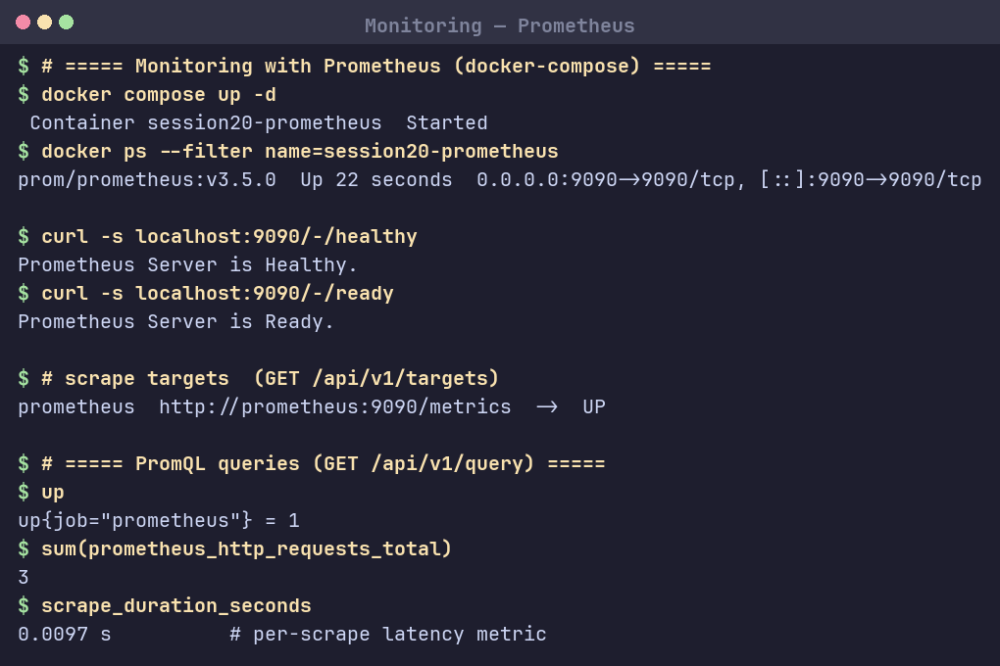
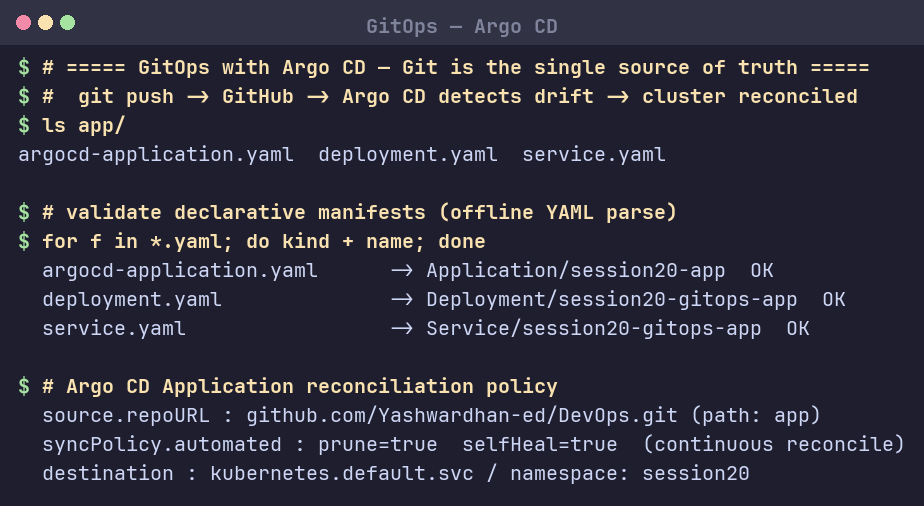

# Session 20: Monitoring, Observability & GitOps

## Task 1: Monitoring
Prometheus ([`03-prometheus/`](03-prometheus/)) scrapes targets and stores time-series metrics.
- **Metrics** — numeric samples over time (`up`, `scrape_duration_seconds`, `prometheus_http_requests_total`).
- **Logs** — event records (`docker logs`, `kubectl logs`).
- **Alerts** — rules fire when a metric crosses a threshold (Alertmanager).
- **CPU / Memory** — `container_cpu_usage_seconds_total`, `container_memory_usage_bytes`.
- **Application health** — `/-/healthy`, `/-/ready` endpoints; `up == 1` means target reachable.

### Screenshot — Prometheus running, targets UP, PromQL queries


## Task 2: Observability — Three Pillars
| Pillar | What it answers | Tools |
|---|---|---|
| **Metrics** | *What* is happening (aggregates, trends) | Prometheus, Grafana |
| **Logs** | *Why* it happened (discrete events) | Loki, ELK |
| **Traces** | *Where* a request spent time across services | Jaeger, Tempo, OpenTelemetry |

**Why observability:** monitoring tells you a known problem occurred; observability lets you ask *new* questions about unknown problems from the data you already emit — essential in distributed/Kubernetes systems. Kubernetes observability = kube-state-metrics + node/cAdvisor metrics + pod logs + traces, visualised in Grafana.

## Task 3: GitOps (Argo CD)
Git is the **single source of truth**; the cluster is continuously **reconciled** to match it.
```
You → git push → GitHub → Argo CD detects drift → Kubernetes updated (self-heal)
```
- **Declarative config** — desired state in YAML under version control ([`07-argocd/app/`](07-argocd/app/)).
- **Continuous reconciliation** — `syncPolicy.automated: { prune: true, selfHeal: true }`.
- **Kubernetes + GitOps** — Argo CD `Application` points at repo path `app`, target namespace `session20`.

### Screenshot — declarative manifests validated + reconciliation policy

