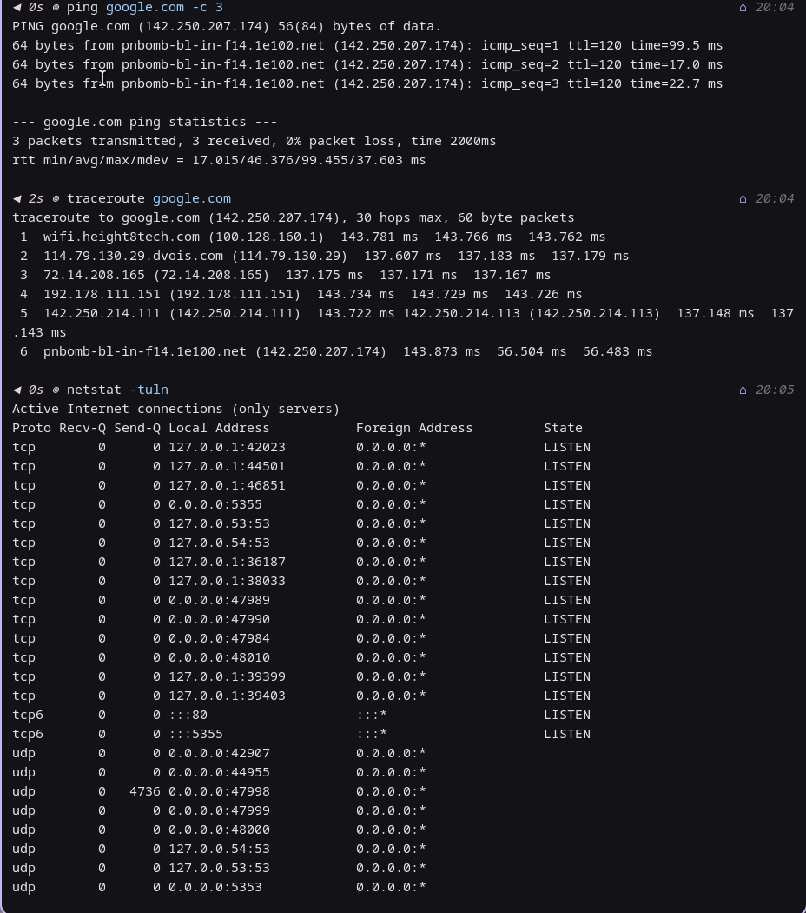
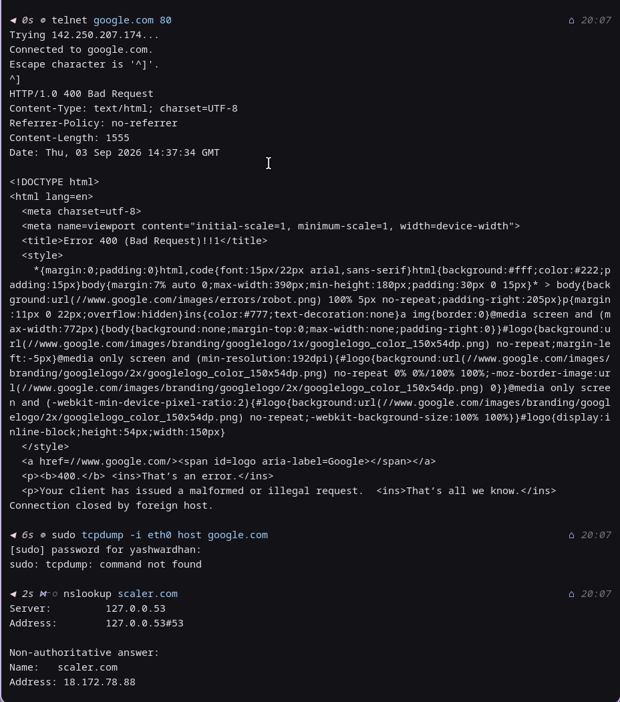
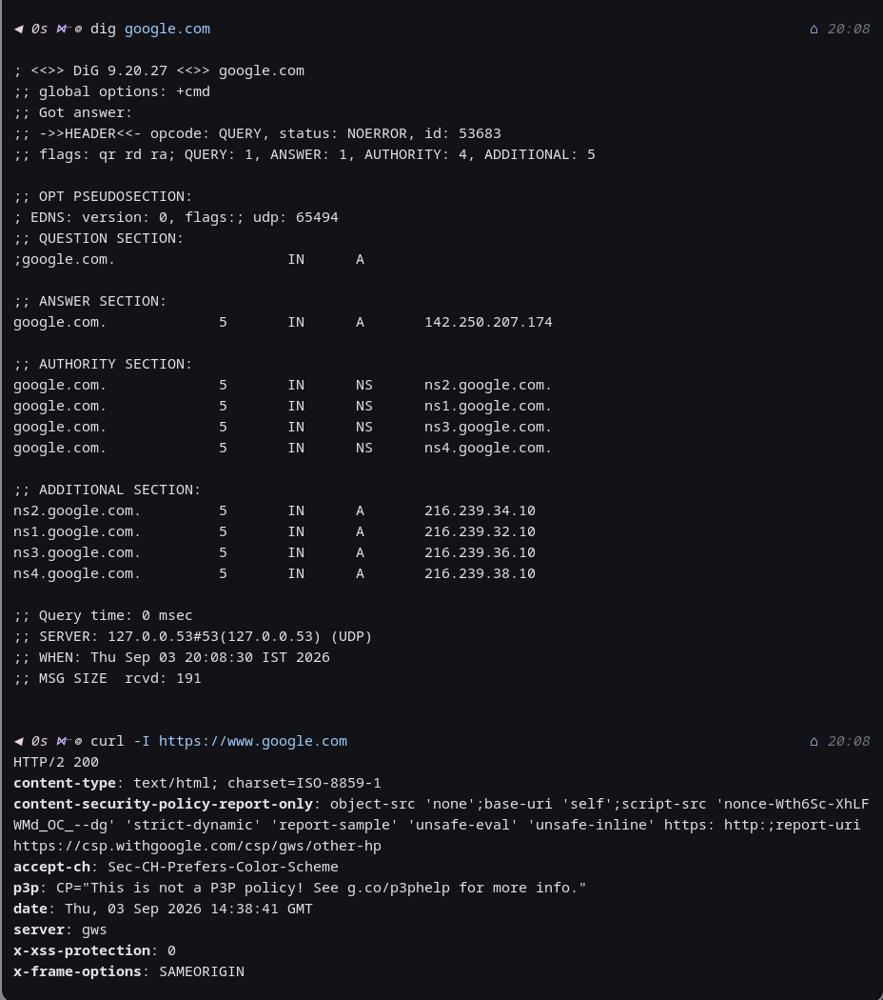
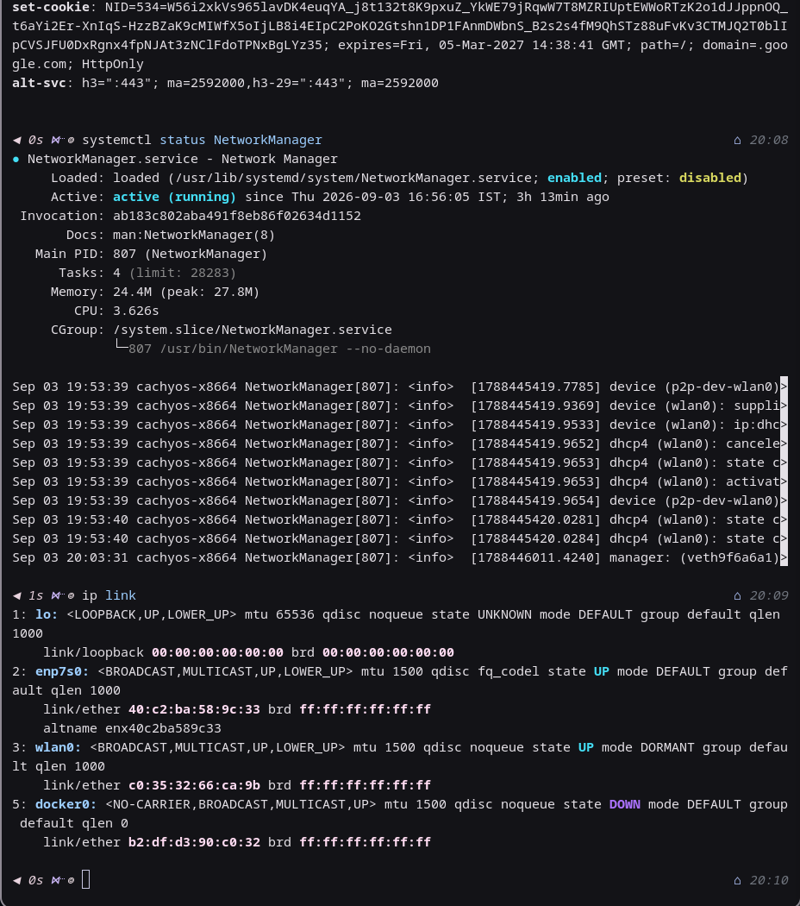

# Linux Networking Commands - Homework

**Name:** Yashwardhan  
**Enrollment Number:** 10411  

---

## Screenshot 1

- `ping google.com -c 3`: Tests network reachability and packet latency to `google.com` by sending 3 ICMP echo requests.
- `traceroute google.com`: Traces the route and lists each intermediate gateway hop packets take to reach `google.com`.
- `netstat -tuln`: Displays all active listening TCP and UDP ports and sockets with numerical IP addresses.

---

## Screenshot 2

- `telnet google.com 80`: Tests TCP socket connectivity to port 80 on `google.com`.
- `sudo tcpdump -i eth0 host google.com`: Captures and inspects live network packet traffic on interface `eth0` involving host `google.com`.
- `nslookup scaler.com`: Queries DNS servers to resolve the domain name `scaler.com` to its corresponding IP address.

---

## Screenshot 3

- `dig google.com`: Performs a detailed DNS lookup querying name servers for DNS records associated with `google.com`.
- `curl -I https://www.google.com`: Sends an HTTP HEAD request to fetch and display only the response headers from `https://www.google.com`.

---

## Screenshot 4

- `systemctl status NetworkManager`: Checks the current operational status, process details, and logs of the NetworkManager service daemon.
- `ip link`: Displays all configured network interfaces on the system along with their operational link status and MAC addresses.
