# Docker Applications - Homework

## 1. Node.js Application
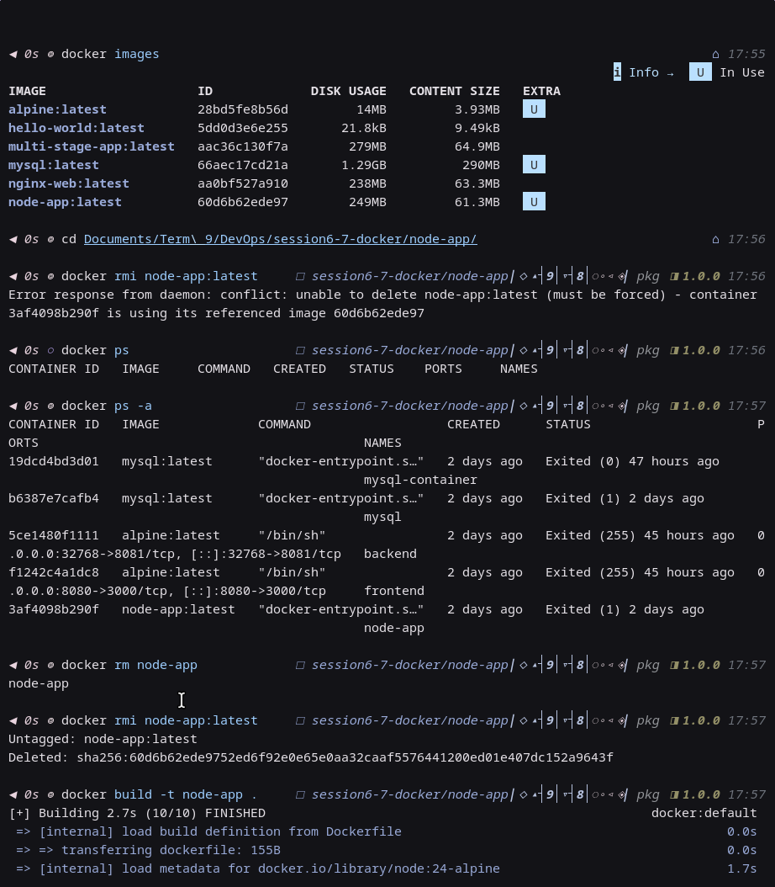
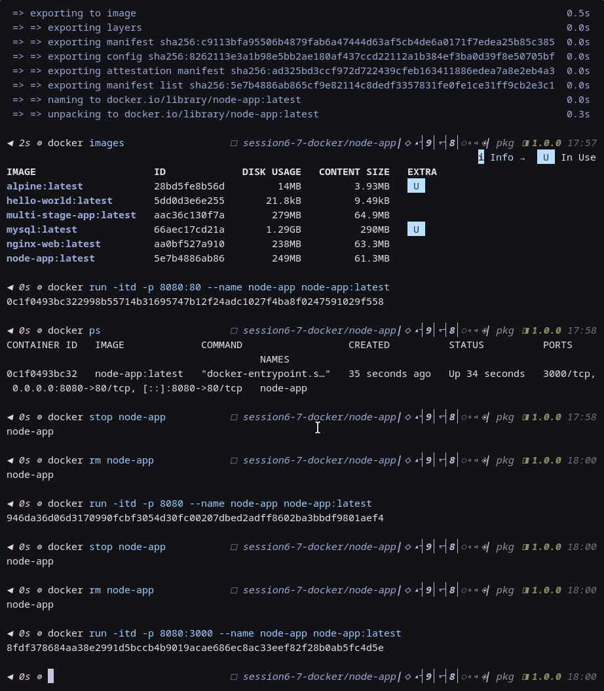
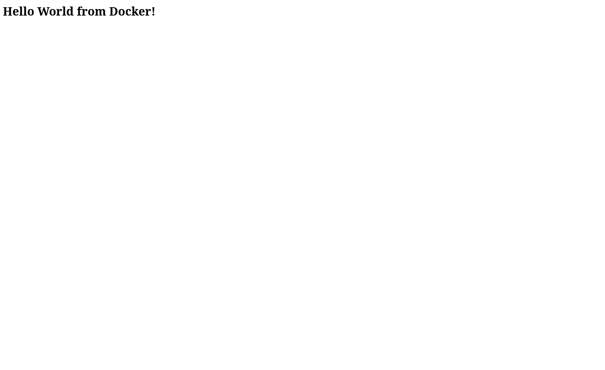

---

## 2. Python Application
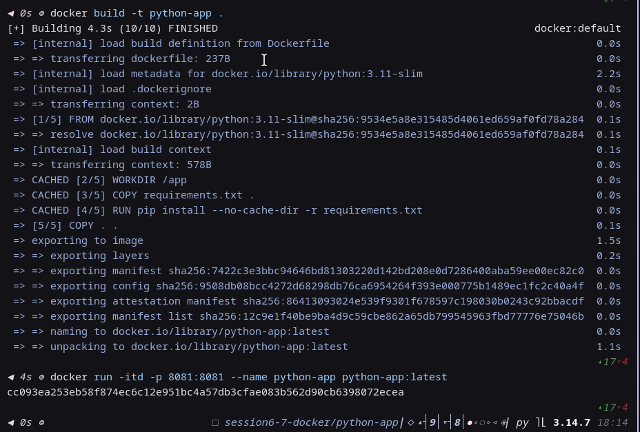
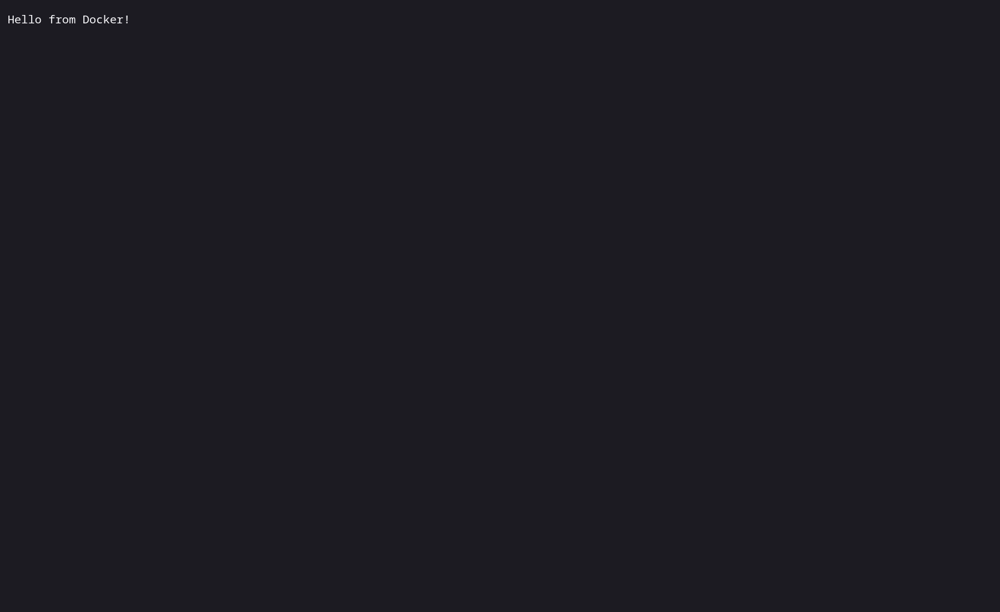

---

## 3. Web / Nginx Application
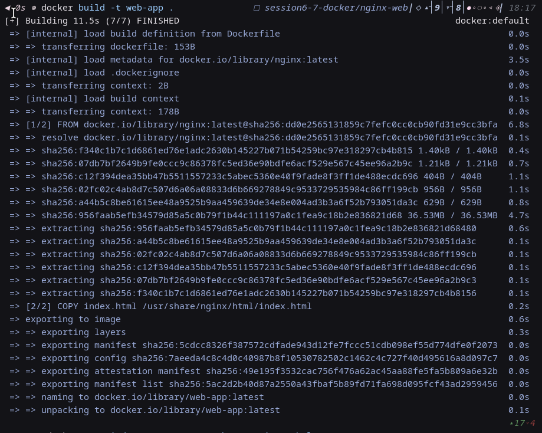
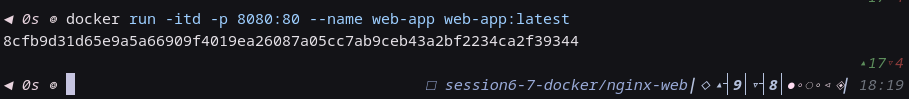
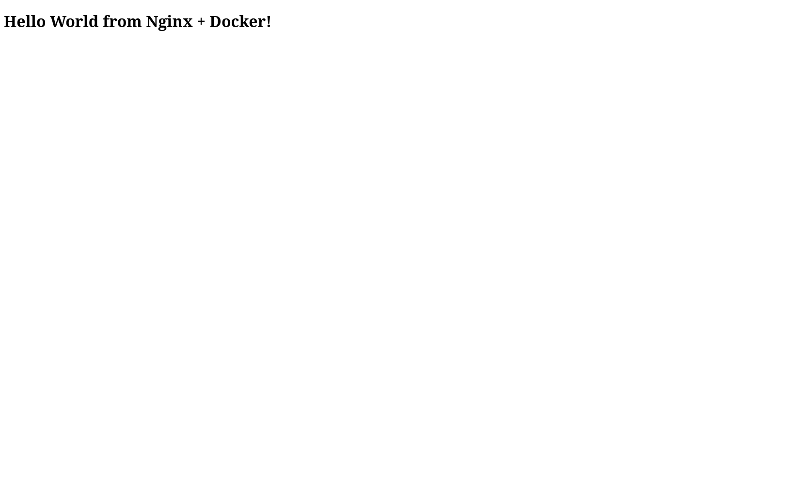

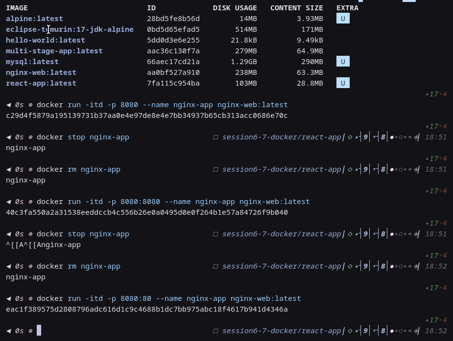
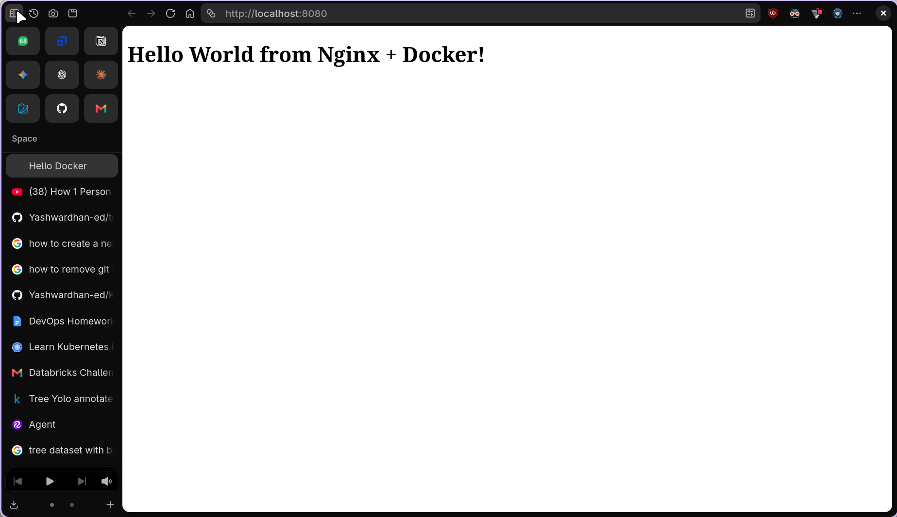

---

## 4. Java Application
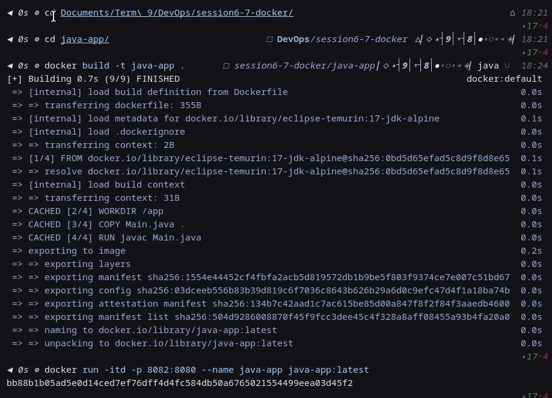

---

## 5. React Application
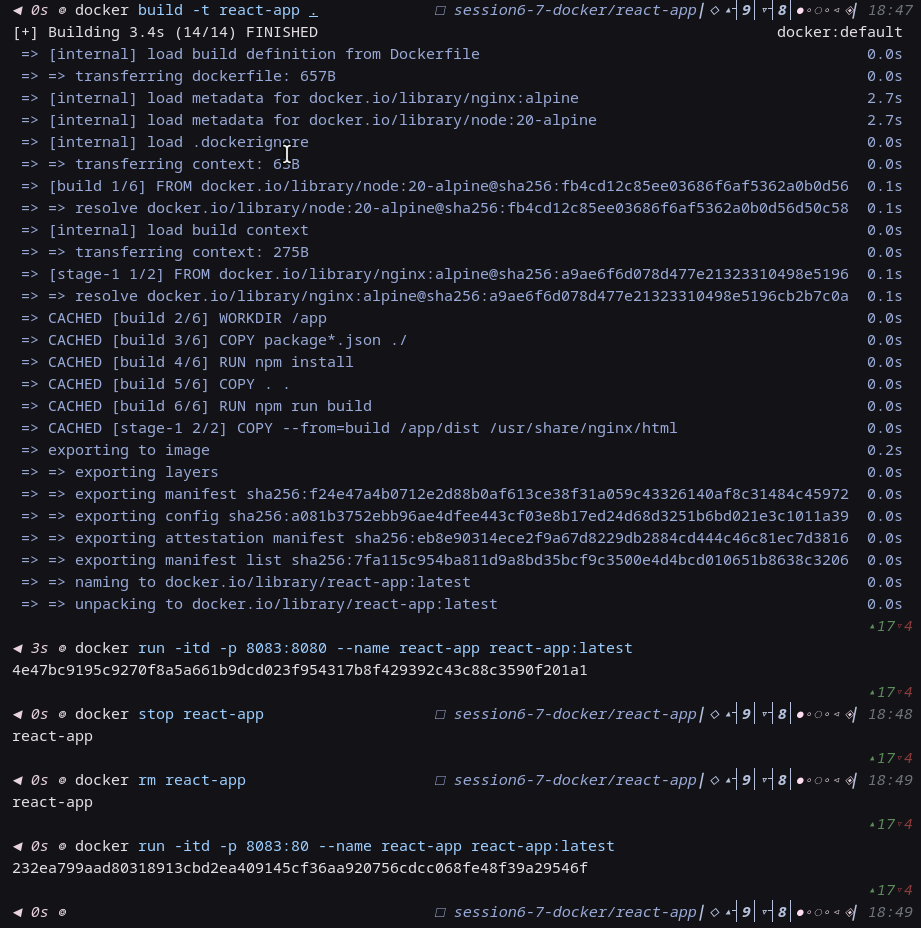
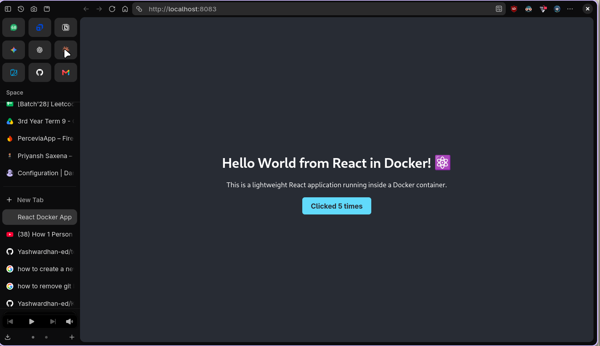
