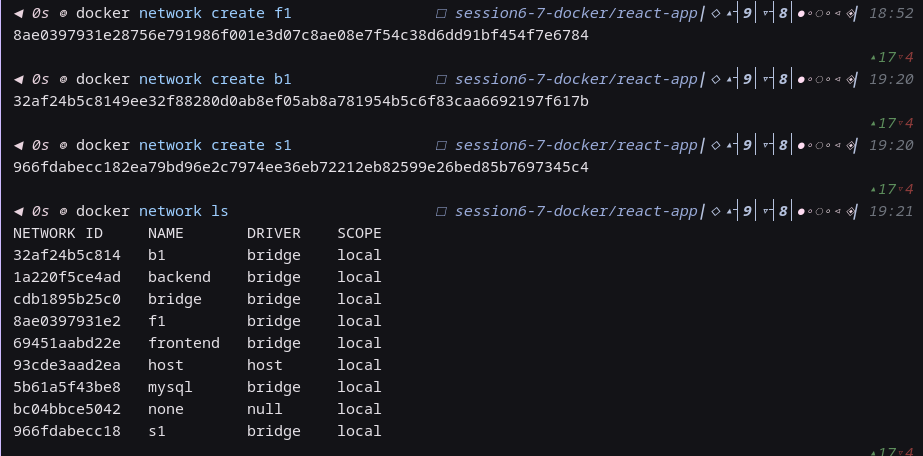
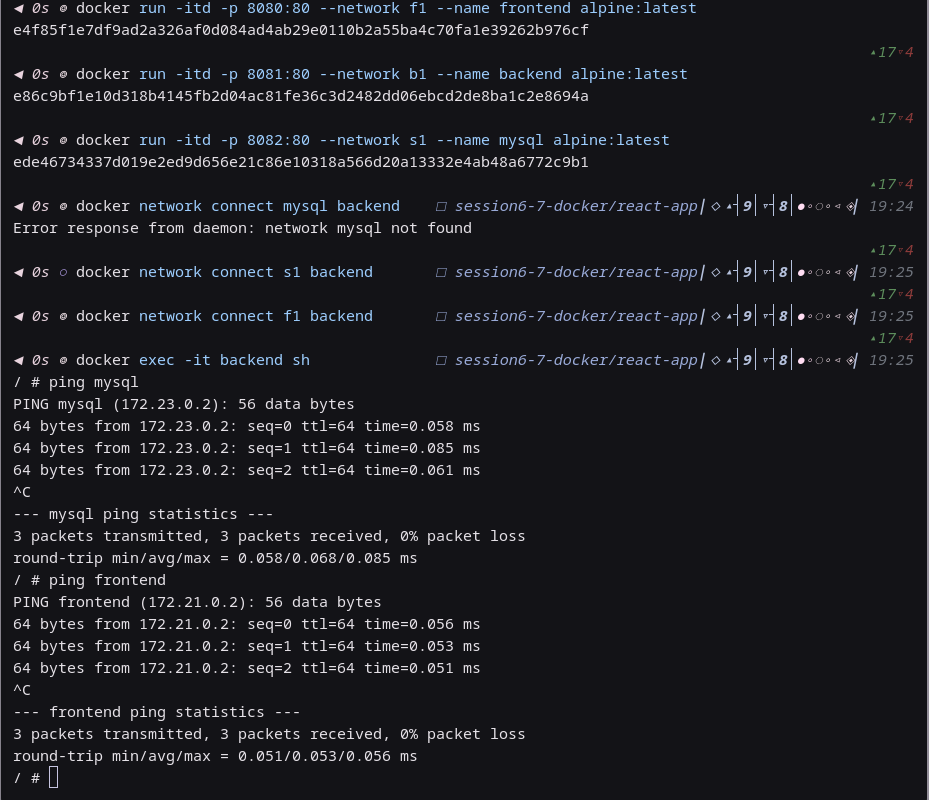
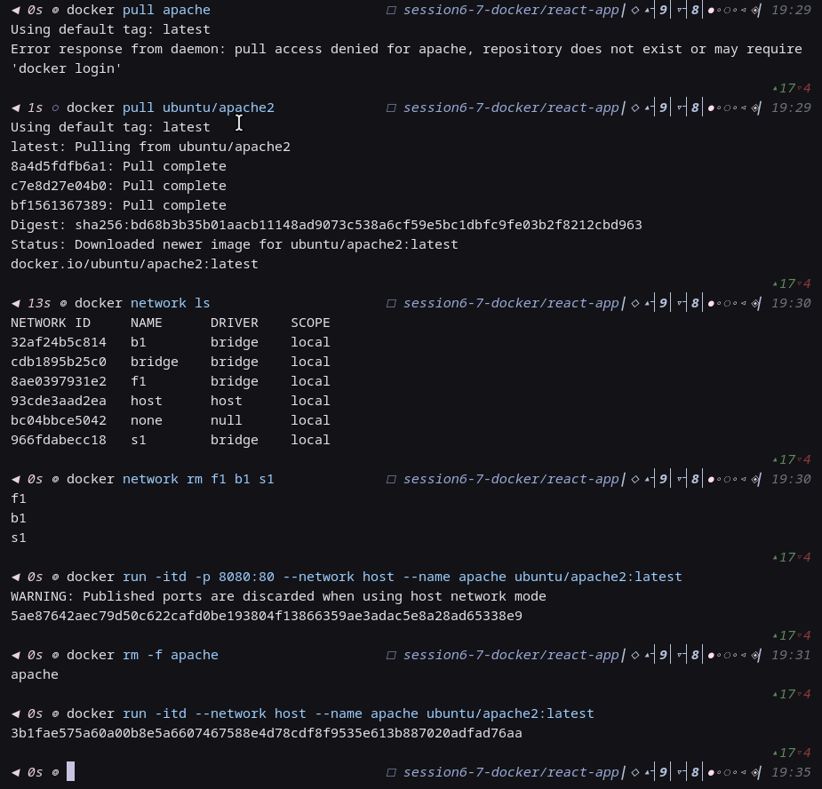
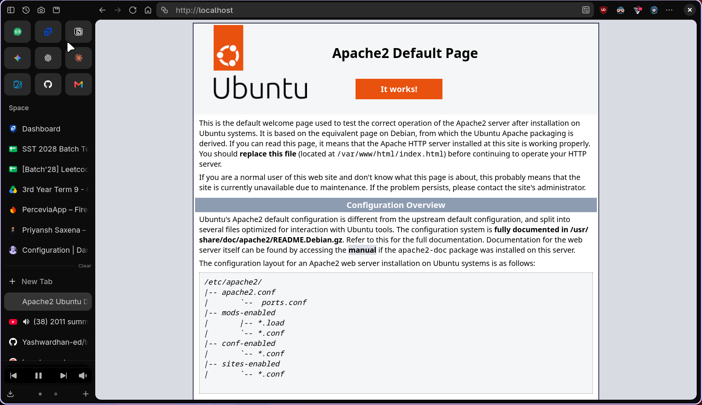
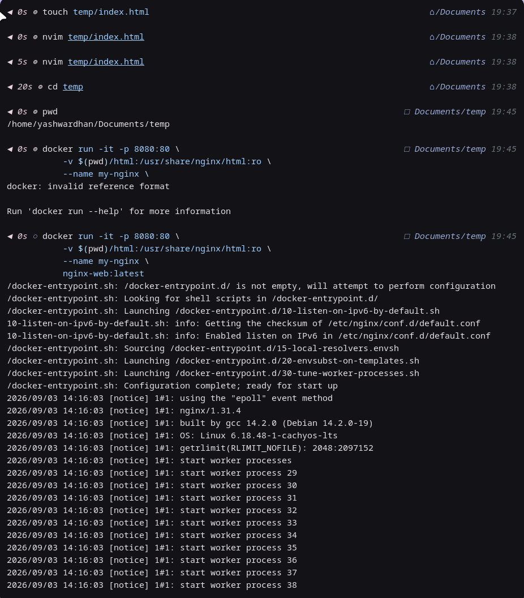
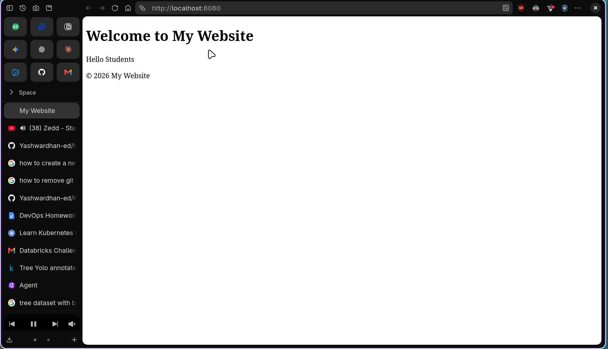
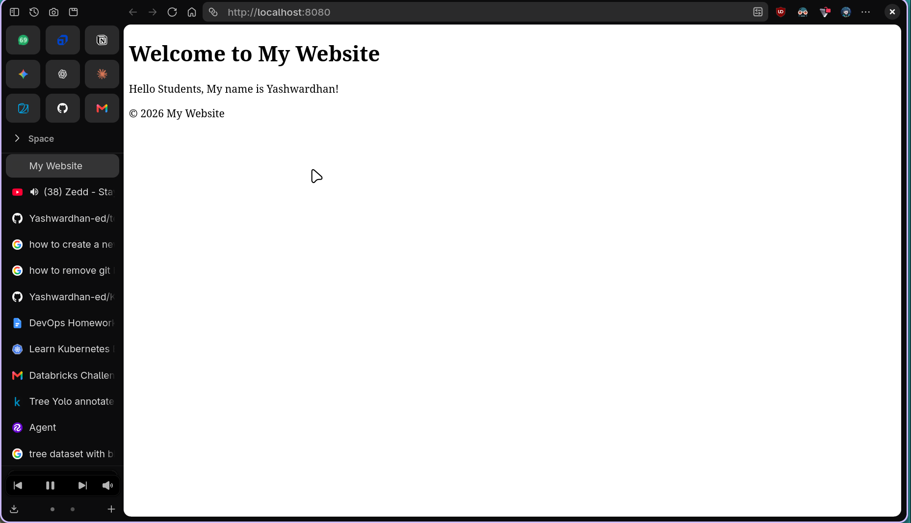

# Docker Networking & Volumes - Homework

**Name:** Yashwardhan  
**Enrollment Number:** 10411  

---

## Task 1: Docker Container Networking

### Commands Used:
```bash
docker network create f1
docker network create b1
docker network create s1

docker run -itd -p 8080:80 --network f1 --name frontend alpine:latest
docker run -itd -p 8081:80 --network b1 --name backend alpine:latest
docker run -itd -p 8082:80 --network s1 --name mysql alpine:latest

docker network connect s1 backend
docker network connect f1 backend

docker exec -it backend sh
ping mysql
ping frontend
```

### Screenshots:
#### 1. Creating Networks and Verifying Network List:


#### 2. Running Containers, Connecting Networks, and Verifying Ping Connectivity:


---

## Task 2: Host Network

### Commands Used:
```bash
docker pull ubuntu/apache2

docker run -itd --network host --name apache ubuntu/apache2:latest
```

### Screenshots:
#### 1. Pulling Image and Starting Apache with Host Network:


#### 2. Accessing Apache Web Server Directly on Port 80 (`http://localhost`):


---

## Task 3: Bind Mount
### Commands Used:
```bash
mkdir temp && cd temp

touch index.html

docker run -it -p 8080:80 -v $(pwd)/html:/usr/share/nginx/html:ro --name my-nginx nginx-web:latest
```








### Task 4: Overlay Network

- **Definition:** An overlay network creates a distributed virtual network across multiple Docker daemon hosts on top of the underlying physical network.
- **Use Cases:** It enables containers in a multi-host cluster (such as Docker Swarm) to communicate with each other securely and directly without exposing ports on the host.
- **How It Works Across Multiple Hosts:** It encapsulates Layer 2 Ethernet frames inside Layer 4 UDP packets using VXLAN on port 4789 to route traffic transparently between different physical Docker hosts.
